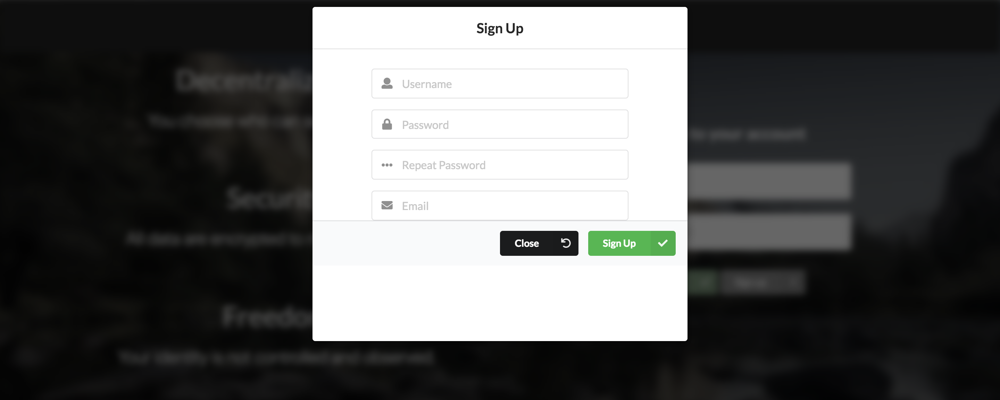
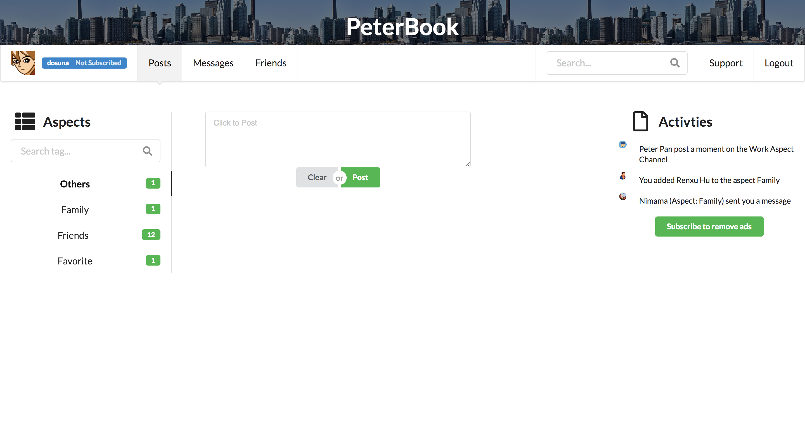
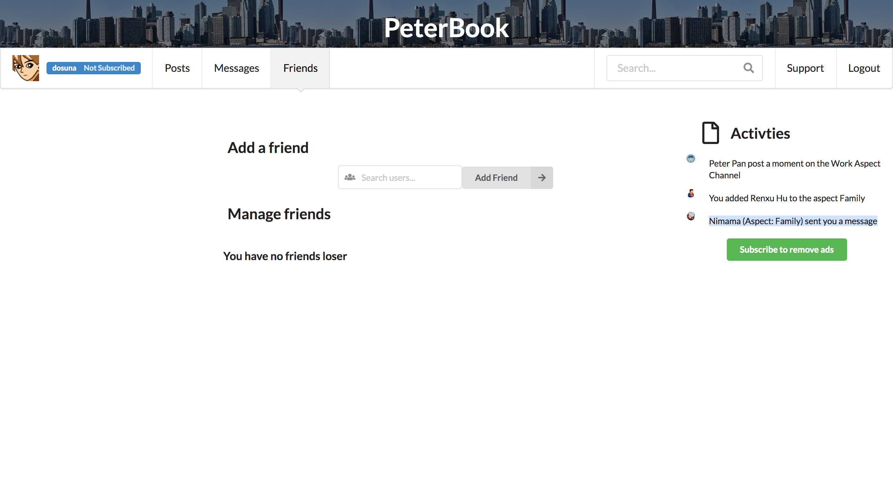
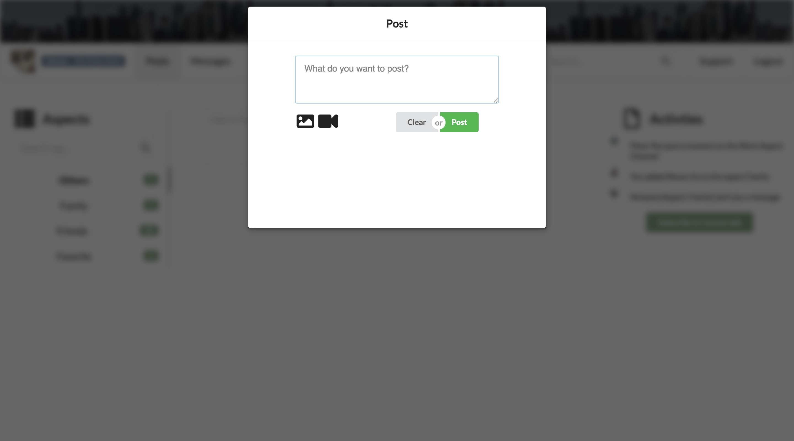
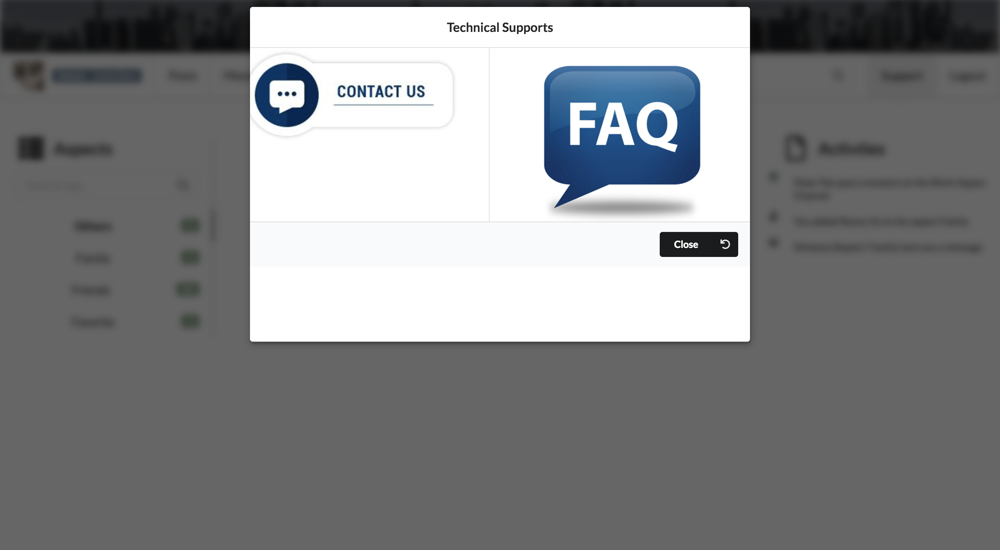

# Simple Workflow 

This file is a description of a simple workflow for developers to understand some of the components that
correspond to their respective JavaScript files with visuals from the PeterBook web app.

## Login Page  

The Login Page allows the user to interact with the web page to login into his social media account.

The default PeterBook page looks like this 

One of the files that corresponds to this workflow is the file `Signup.js` for signing up for an account.

Another file that corresponds with the login page is the file `Login.js` for logging into your account.

When you click on the login button, the file that corresponds with that is `Main.js`

## User Dashboard 

When the user logs into his account he will experience this user dashboard. The file that corresponds to this 
is the `Aspect.js` file for loading the user dashboard.

## User Interactions 

We allow the user a lot of self autonomy to interact with their profile.

### Navigation Bar  

A user can traverse their profile using the navigation bar which corresponds to the `NavBar.js` file.

### Friend Management 

A user can manage his friends which corresponds to the `FriendManagement.js` file.

### New Posts 

We allow the user to make new posts which corresponds with the `NewPost.js` file.

### Technical Support 

A user can request technical support which corresponds to the `TechnicalSupport.js` file.

## Higher Level Description of JavaScript Files 

`Note:` That simple_workflow.md is an oversimplified guide to describe some of the major components 
of the PeterBook Web Application. 

For a higher level description of the JavaScript files please check out our ESDoc Generated Documentation.

To generate ESDoc Documentation checkout the files `esdoc_setup.md` or `quick_setup_scripts.md`.